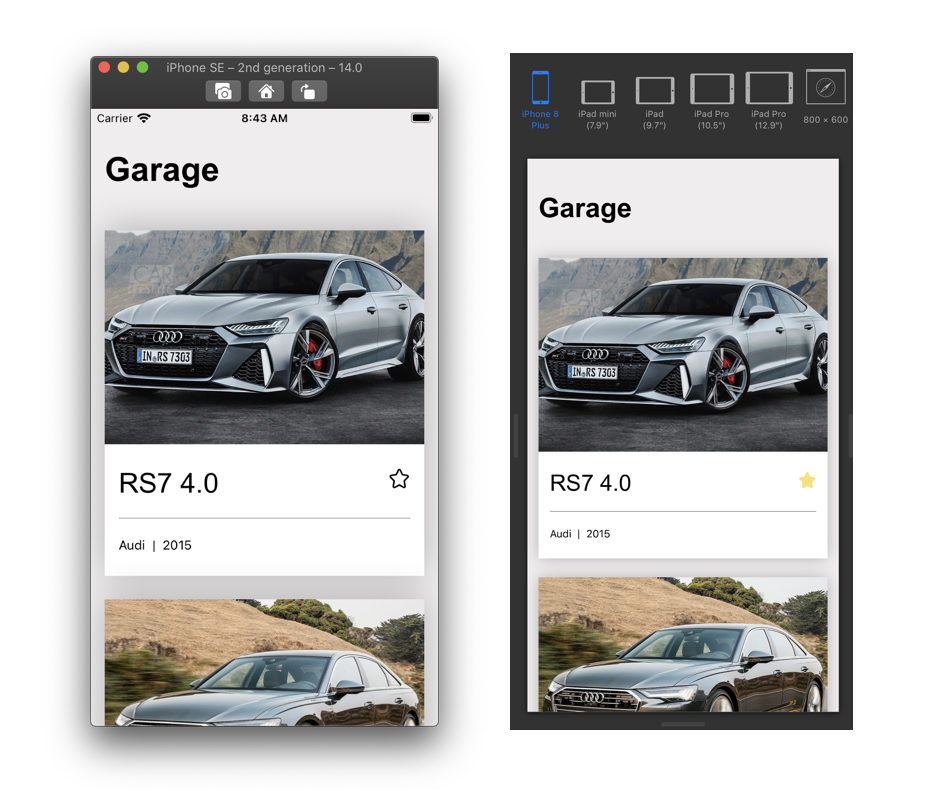

# Code Challenge - ITCrowd

---

## Garage APP

This repo is a working project that lists cars based on a local API response. It contains both the backend and the frontend app, and it aims at testing candidates' abilities to solve real-world problems, without demanding too much time setting up everything.

## Challenge ideas
- My idea was to focus in the fuctionality of the application.
- I created 3 (three) videos where I talk and explain a little bit of what I thought to deliver in this challenge

- [Setup Video](https://www.loom.com/share/551130030c8e450ebdb3d7f61ed12fb4)
- [App Running Video](https://www.loom.com/share/ab09227d24ff48d099acfa674a094e4e)
- [UnitTests Video](https://www.loom.com/share/2759bedbb7bc4c3b92c16426741330e5)

In those tutorials I teach you how to setup the application, run and test it.
I hope you enjoy it!

### Homework

These tasks are recommended to be completed before the technical interview, where we will hold a pair-programming session with some extra quick tasks.

- [ ] Implement a relational DataBase (use SQLite for simplicity), with two entities, one for Makers and another for Cars. Use the same fields as provided by `cars.json` file. Each Maker can have several Cars.

- [ ] Consider implementing a resizing and cache system for served images. What approach would you take? What libraries or services? There's no need to implement it fully, but an example or a simple implementation will be appreciated.

- [ ] Implement a 'Detail' screen on the frontend app, following the same design principles and using the same information already provided.
